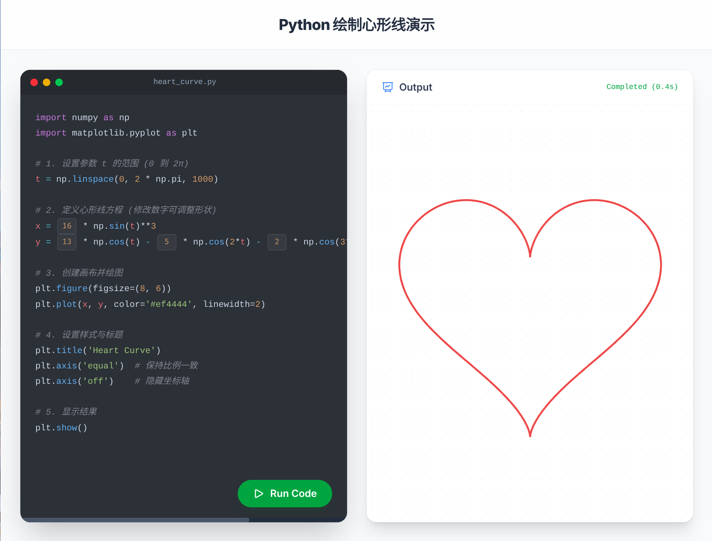

# H5-Heartcurve

## Take a quick look？

[GitHub Page](https://lingyicute.github.io/H5-Heartcurve)

## 🗂️ License

H5-Heartcurve is released under the GNU General Public License v3.0 (GPLv3).

Copyright (C) 2024-2026 lingyicute.

This program is free software: you can redistribute it and/or modify
it under the terms of the GNU General Public License as published by
the Free Software Foundation, either version 3 of the License, or
(at your option) any later version.

This program is distributed in the hope that it will be useful,
but WITHOUT ANY WARRANTY; without even the implied warranty of
MERCHANTABILITY or FITNESS FOR A PARTICULAR PURPOSE.  See the
GNU General Public License for more details.

You should have received a copy of the GNU General Public License
along with this program.  If not, see https://www.gnu.org/licenses.
